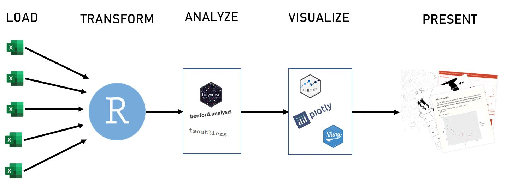

# Case Study 1 S S2020 - Konzept
_David Krug, Till Bieg_

Dieses Konzept wurde im Rahmen der Lehrveranstaltung `Case Study 1 ILV S2020` an der Fachhochschule Wiener Neustadt erstellt. Es beschreibt den geplanten Technology-Stack, ETL-Prozess und Schwerpunkt von Analysen hinsichtlich eines rechnungslegungsbezogenen Datensatzes, der innerhalb der Lehrveranstaltung zur Verfügung gestellt wurde.

## 1) Geplanter Technology-Stack

Wir planen die Verwendung des folgenden Technology-Stacks, um die gegebenen Daten zu analysieren:

* Microsoft Excel (MS Excel)
* R mit RStudio und folgenden Packages (Auswahl):
  * `readxl`: Zum Import von MS Excel-Dateien in R
  * `dplyr`: Zur Datenmanipulation (z.B. Filtern, Selektieren, Aggregieren)
  * `tidyr`: Zur Datenmanipulation (z.B. Pivotieren)
  * `lubridate`: Zur Manipulation von zeitbezogenen Variablen (z.B. Datum)
  * `ggplot2`: Zur Erstellung statischer Grafiken
  * `plotly`: Zur Erstellung von interaktiven Grafiken
  * `shiny`: Zur Erstellung von Dashboards und interaktiven Grafiken
  * `rmarkdown`: Zur Erstellung und Export von Analyseberichten
  * `benford.analysis`: Zur Durchführung von Benford-Analysen
  * `tsoutliers`: Zur Analyse von Zeitreihen-Daten (z.B. Ausreißerdetektion)

Je nach Anforderungen, die im Verlauf der Analyse erkennbar werden, behalten wir uns vor, zusätzliche Packages zu verwenden, um die Analyse nach besten Möglichkeiten durchzuführen.

## 2) Geplanter ETL-Prozess

Die Daten aus den bereitgestellten `MS Excel`-Dateien werden unter Verwendung des `readxl`-Packages unmittelbar in die globale Environment von `R` geladen. Hierbei ist darauf zu achten, dass die Daten innerhalb einer `MS Excel`-Datei gegebenenfalls auf mehrere Arbeitsblätter aufgegliedert sind. Obwohl die Datenmenge ingesamgt relativ umfassend ist, wird es ohne Weiteres möglich sein, diese Daten in den Arbeitsspeicher zu laden und entsprechende Analysen durchzuführen. Deswegen ist die Verwendung einer Datenbank im Rahmen des ETL-Prozesses nicht unbedingt notwendig.

Für die Datenaufbereitung und -analyse wird wie bereits erwähnt die statstische Programmiersprache `R` verwendet. Dabei bedienen wir uns der umfangreichen Auswahl an Packages des `tidyverse` (z.B. `dyplr`, `tidyr`, `lubridate`). Für spezifische Analysen (zum Beispiel Benford- oder Zeitreihen-Analyse) werden darüber hinaus weitere Packages verwendet (zum Beispiel `benford.analysis` und `tsoutliers`). Um die Daten zu explorieren und Ergebnisse anschaulich darzustellen wird ein wesentlicher Schwerpunkt auch auf der Datenvisualisierung liegen. Diesbezüglich ist die Verwendung von Packages wie `ggplot2`, `shiny` und `plotly` angedacht.

Für die Vorbereitung der Präsentation und die schriftliche Ausarbeitung werden wir in erster Linie `rmarkdown` verwenden, wobei ein Rückgriff auf andere Formate (z.B. `shiny`) nicht im Vorhinein ausgeschlossen ist.

## 3) Geplanter Schwerpunkt der Analysen

Grundsätzlich liegt der Schwerpunkt der Analysen auf der Identifizierung von dolosen Handlungen (unangemessene Einträge) beziehungsweise betrügischer Aktivitäten (Orientierung an den International Standards on Auditing). Allgemeine Anhaltspunkte hierfür können beispielsweise bestimmte Buchungsmuster und Aktivitäten sein, die vergleichsweise selten durchgeführt wurden. Indizien werden auf Basis der Daten zusammengetragen und analysiert. Dazu werden grundlegende Validitätschecks, Methoden aus dem Journal Entry Testing und fortgeschrittenene datenanalytische Prüfungshandlungen angewendet. Die Analyse wird auf oberster Granularitätsebene begonnen und anhand gefundener Indizien zunehmend feingranularer gestaltet. Je nach Bedarf werden verschiedene Prüfungshandlungen kombiniert, um Auffälligkeiten weiter nachzugehen.

Anzumerken ist, dass die Analyse des Datensatzes explorativen Charakter besitzt und sich je nach Beschaffenheit der Daten zusätzliche Auswertungen empfehlen. Daher ist die folgende Aufzählung nicht als erschöpfend zu betrachten. Die Daten werden hinsichtlich folgender Aspekte überprüft, insbesondere um Indizien für unangemessene Einträge beziehungsweise betrügerische Aktivitäten zu finden:

### Grundlegende Validitätschecks

Um die grundlegende Validität der Daten zu überprüfen, werden beispielsweise Soll und Haben der Bilanz miteinander verglichen. Die Einträge in der Datei `ABC 2014 JE` werden dementsprechend nach Soll oder Haben klassifiziert und aufsummiert. Anschließend werden sie gegenübergestellt. Falls die beiden Werte voneinander abweichen, liegt ein grundlegender Fehler in der Buchführung der Firma vor. Ebenfalls sollten die Zeilenummern innerhalb eines Journaleintrags lückenlos sein und auch die Beträge innerhalb eines einzelnen Journaleintrags in Summe Null ergeben. Weiters werden wir die Differenz von Anfangs- und Endsaldo in der Datei `ABC TB and CoA` mit dem Bilanzergebnis aus der Datei `ABC 2014 JE` vergleichen. Auch diese Summen müssen übereinstimmen. Zusätzlich werden wir prüfen, ob der vorliegende Datensatz alle Variablen enthält, die standardmäßig in rechnungslegungsbezogenen Datensätzen vorhanden sein sollten. Wenn Variablen fehlen, lassen sich offensichtlich bestimmte Analysen nicht durchführen - eine umfassende Prüfung ist somit nicht möglich. Schließlich erfolgt auch eine inhaltliche Prüfung der Daten auf deren Validität, zum Beispiel ob Eintragungen im Buchungstext überhaupt aussagekräftig beziehungsweise valide sind.

### Prüfungen der buchenden Personen

In diesem Zusammenhang werden zunächst die verschiedenen Personen identifiziert, die im Buchungsprozess involviert waren. Auch die Abteilung, der eine jeweilige Person angehört, kann von Bedeutung sein. Auf dieser Grundlage können wir analysieren, welche Personen wie oft Buchungen durchgeführt haben. Dabei ist grundsätzlich anzunehmen, dass beispielsweise Personen aus der Buchhaltungsabteilung, die häufig Buchungen durchführen, weniger Fehler machen als Personen, die selten Buchungen durchführen. Besonderes Augenmerk liegt auf Beträgen von Personen, die typischerweise keine Buchungen durchführen, da dies ein weiterer Hinweis auf betrügerische Aktivitäten sein kann.

### Prüfungen der Buchungs- und Erfassungszeit

Bei diesen Prüfungen geht es darum, Buchungen mit ungewöhnlichen Buchungs- und Erfassungszeiten zu identifizieren. Grundsätzlich sollte jede Buchung einem Datum zugeordnet sein, da dies Voraussetzung für eine korrekte Buchführung ist. Ungewöhnlich sind beispielsweise Buchungen am Wochenende oder außerhalb der Geschäftszeiten, zum Beispiel zwischen 22:00 und 5:00 Uhr. Verdächtig kann auch eine Häufung von Buchungen zum Jahresende sein (da eine betrügerisch handelnde Person wissen könnte, ob bestimmte Jaresziele schon erreicht wurden und so leichter Buchungen einschleichen könnte). Außerdem werden wir prüfen, ob ein gegebenes Belegdatum immer im entsprechenden Geschäftsjahr und nie *nach* dem jeweiligen Erfassungsdatum liegt. Um zu beurteilen, ob eine Buchungszeit tatsächlich ungewöhnlich ist, muss auch der spezifische Kontext berücksichtigt werden: In einem großen internationalen Versandhandelskonzern lässt sich beispielsweise davon ausgehen, dass Buchungen laufend durchgeführt werden.

###  Prüfungen der verwendeten Konten

Die genaue Betrachtung von ungewöhnlichen beziehungsweise selten verwendeten Konten kann Hinweise auf betrügerische Aktivitäten geben.

### Prüfungen der Höhe beziehungsweise der Ziffern von Beträgen

Auch die Höhe und Ziffernverteilung von Beträgen kann ein wichtiger Anhaltspunkt für betrügerische Aktivitäten sein. Beispielsweise sind Beträge verdächtig, die runde Zahlen (zum Beispiel 100,00 Euro) oder immer dieselben Endziffern aufweisen. Ebenso werden wir nach Beträgen suchen, die knapp unterhalb (allgemeiner) Freigabegrenzen liegen (denkbar wäre zum Beispiel eine Häufung von Beiträgen knapp 1000 Euro). Da die Verteilung von Ziffern in Bezug auf finanzielle Daten in der Regel der Benford-Verteilung folgt, planen wir außerdem die Durchführung einer Benford-Analyse: Wenn die Ziffernverteilung von Buchungsbeträgen nicht der Benford-Verteilung folgt, ist das ein Indiz für Betrug. Diese Analyse kann für die unterschiedlichen Stellen der Beträge durchgeführt werden (erste Stelle, zweite Stelle, ...). Wichtig ist in diesem Zusammenhang die Wahl eines angemessenene Granularitätsniveaus (zum Beispiel die Aufgliederung der Analyse nach Kontoklassen), um zu verhindern, dass einzelne betrügerische Buchungen in der hohen Gesamtzahl aller Buchungen übersehen werden.

### Prüfungen auf Unterschiede zum Vorjahr (Trendanalysen)

In diesem Rahmen werden verschiedene Daten aus dem zu prüfenden Jahr mit Daten aus dem Vorjahr verglichen, um ungewöhnliche Abweichungen beziehungsweise Ausreißer zu finden (zum Beispiel Umsätze in einem bestimmten Monat, die stark von den Umsätzen des Vorjahres abweichen). Ergebnisse aus diesen Analysen sind (wie alle weiteren Ergebnisse auch) mit dem Management des geprüften Unternehmens zu besprechen, um möglichen Alternativerklärungen für diese Abweichungen auf den Grund zu gehen.

### Prüfungen des Buchungstexts
Hier lässt sich nach verdächtigen Buchungen suchen, die wenige bis keine Erläuterungen im Buchungstext enthalten. Außerdem lassen sich Buchungen hinsichtlich bestimmter Inhalte (zum Beispiel bestimmte Stichwörter) analysieren, um potentielle Buchungsmuster zu finden.
